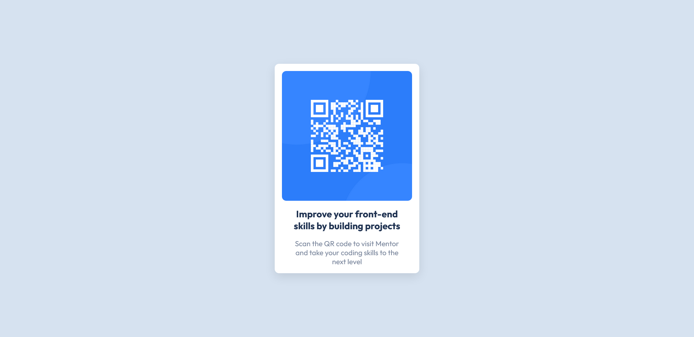

# QR Code Card Component

This is my solution to the [QR code component challenge on Frontend Mentor](https://www.frontendmentor.io/challenges/qr-code-component-iux_sIO_H).

## Overview

This is a basic card component that displays a QR Code that the user can scan with it's cellphone.

### Screenshot



## My process

I just went through some CSS clases and adding responsive typography to scale accordingly to the users' viewport size. By the way I really enjoyed the color selection.

### What I learned

I reinforced how responsive typography works, and a little bit of small troubleshooting when it comes to reset general CSS that was giving me undesired results

So I thought I only needed:

```css
*,
*::before,
*::after {
  padding: 0;
  margin: 0;
  box-sizing: border-box;
}
```

But then, since `headings` comes with a little bit of font-size by default (I forgot that) I needed to also reset the typography elements.

```css
h1,
h2,
h3,
p {
  font-size: 1em;
}
```

### Continued development

I want to keep focusing on responsive typography, as I think it's the main focus and the principal factor for attracting users to our website.

## Author

- Frontend Mentor - [874anthony](https://www.frontendmentor.io/profile/874anthony)
